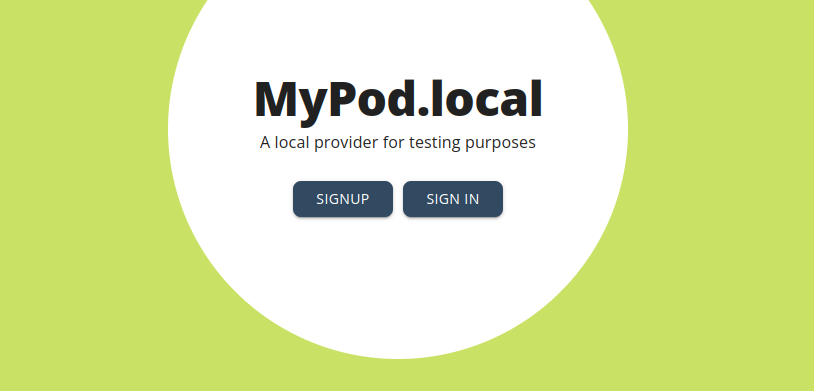

We created a boilerplate to help you quickly setup a social app in a local environment, and connect it with a local Pod provider. In just a few minutes, you should be able to play with your first ActivityPods-compatible app!

## Requirements

- Git
- Makefile
- [Docker](https://docs.docker.com/engine/install/) (make sure you have the `docker-compose-plugin` installed)
- [NodeJS](https://nodejs.org) 20.0 or above
- [Yarn](https://yarnpkg.com/)

## Clone the boilerplate repository

First clone the [boilerplate repository](https://github.com/activitypods/app-boilerplate):

```bash
git clone https://github.com/activitypods/app-boilerplate.git
```

## Setup environment variables

A single environment variable is required: the MapBox access token to autocomplete the location field on the Pod provider frontend.

Fortunately MapBox has a generous free tier with 100,000 requests per month, so you should not need to pay anything. But you still need to get the token. [See this page](https://docs.mapbox.com/help/getting-started/access-tokens/) for more information.

Once you have your access token, copy the `.env` file at the root directory into a `.env.local` file and set it there.

```bash
cp .env .env.local
nano .env.local
```

:::note
We would like to find an alternative to MapBox so that the Pod provider can be launched without any environment variable. If you have some tips, let us know!
:::

## Run the Pod provider

In order to locally run the boilerplate, you need a local Pod provider, because a remote Pod provider will not be able to interact with a local application backend.

Fortunately, we provide [Docker images](https://hub.docker.com/orgs/activitypods/repositories) to launch a local Pod provider in a single command:

```bash
make start
```

This will also launch Jena Fuseki (the triplestore used to store semantic data) and Redis, which are needed by the Pod provider and will also be used by the application.

:::note
An alternative to creating a local Pod provider is to use a tunnel for your boilerplate app like [Ngrok](https://ngrok.com/), [zrok](https://zrok.io/) or [loophole](https://loophole.cloud/docs/guides/expose) so that your application backend is accessible from the web. Feel free to improve this guide if you chose this solution!
:::

## Create an account

If everything is running fine, you should be able to access your newly-created Pod provider at http://localhost:5000



The environment variables you setup in the previous step, and some other configurations variables, should be visible at http://localhost:3000/.well-known/config.js (this javascript file is loaded by the frontend at the very beginning).

You can go ahead and create an account.

The Fuseki interface is accessible at http://localhost:3030. In local environment, the login and password are "admin". After having created your first account, a dataset should be created with the same name. There should be a `settings` dataset as well, which list all available accounts.


:::note
If there is a problem, in particular if the second link is not working, you can access the Pod provider backend with this command `make attach-activitypods`. This will give you access to ActivityPods' Moleculer CLI. [Moleculer](https://moleculer.services/) is the microservice framework that all ActivityPods services run on. If there are errors, they will be displayed here.
:::

## Launch the backend

Although Docker could also be used to launch the application backend, we recommend to launch it outside of Docker to avoid the usual problems we encounter in containerized environments.
The boilerplate application backend uses the [Moleculer](https://moleculer.services/) microservice framework for node.js as well.

On the other hand, we will use the same Fuseki and Redis server as used for the ActivityPods backend.

```bash
cd backend
yarn install
yarn run dev
```

This will bootstrap the server and, if there are no errors, finish with a message telling you that the Moleculer ServiceBroker has started.

You can see the application details at http://localhost:3001/app

## Launch the frontend

Now you can launch the app frontend.

```bash
cd frontend
yarn install
yarn run dev
```

A browser window should automatically be launched. If not, you can access the app frontend at http://localhost:4000

## Play with the boilerplate

The "Hot module reload" feature is activated on both frontend and code, so you can do changes to the code and it will be visible almost immediately.

For the frontend, check the excellent [React-Admin documentation](https://marmelab.com/react-admin/Readme.html) to find what you can do. Have a look at [SemApps website](https://semapps.org/docs/frontend) for specific components.

For the backend, you will find plenty of documentation on this website.

You can test emails are correctly sent by opening up the Mailcatcher interface at http://localhost:1080. You can also watch the jobs queue at http://localhost:4567

Enjoy! And if you run into any problem, please don't hesitate to open an [issue](https://github.com/activitypods/activitypods/issues)!
